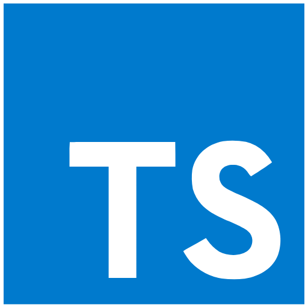
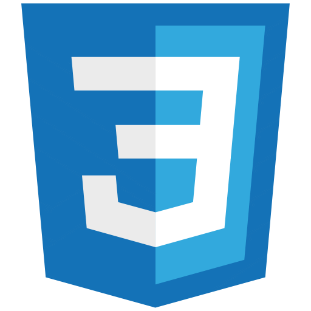
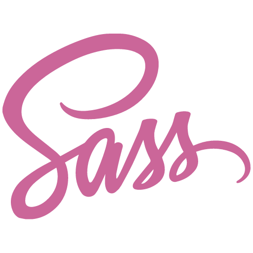
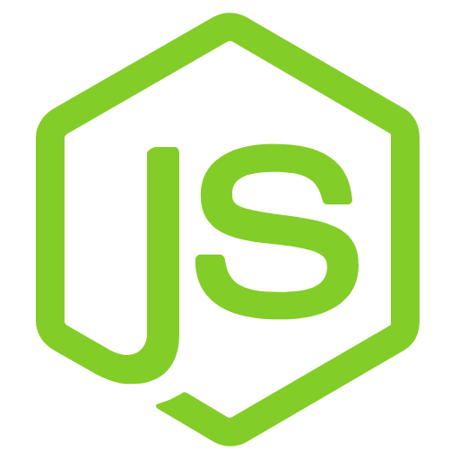
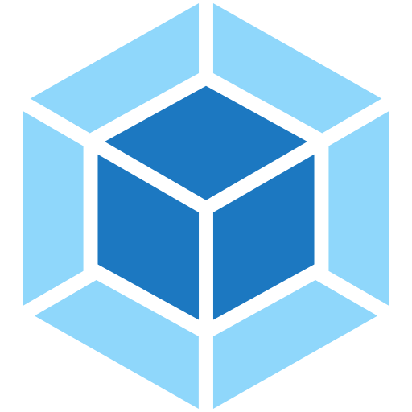
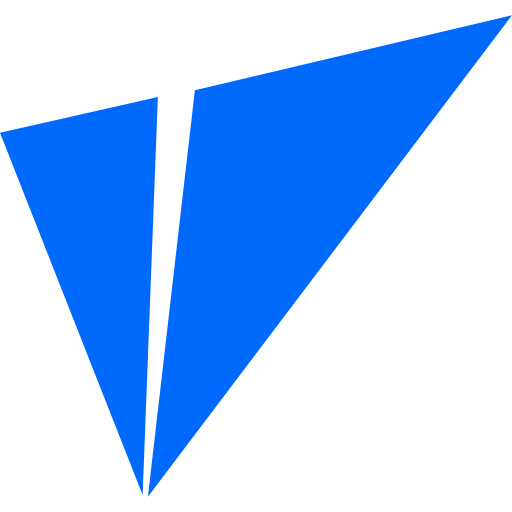

### Hi there! I'm Lillian 👋

  

<h4>About Me</h4>

I’m a software engineer and creator with a knack for building innovative web applications and component libraries. My journey in tech has been fueled by a love for solving complex problems and delivering high-quality, accessible solutions. Whether it’s crafting scalable frontend architectures, optimizing state management, or building robust backend systems, I’m always eager to explore new technologies and refine my skills.

I’m always open to collaboration and love sharing knowledge, so feel free to reach out or explore my repositories to see what I’m up to!

<h4>Languages and Tools</h4>

  
  
  <!--  -->
  
  
  
  
  
  
  
  
  
  
  
  <!--  -->
  
  
  
  
  

<!-- 
 -->
<!-- <h4>GitHub Stats</h4>

 -->
<!--
**tenn501/tenn501** is a ✨ _special_ ✨ repository because its `README.md` (this file) appears on your GitHub profile.

Here are some ideas to get you started:

- 🔭 I’m currently working on ...
- 🌱 I’m currently learning ...
- 👯 I’m looking to collaborate on ...
- 🤔 I’m looking for help with ...
- 💬 Ask me about ...
- 📫 How to reach me: ... 
- 😄 Pronouns: ...
- ⚡ Fun fact: ...
-->
